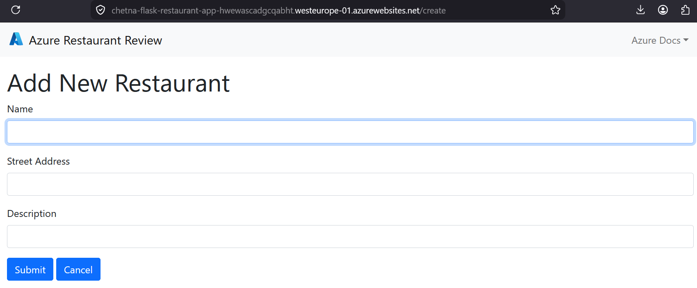
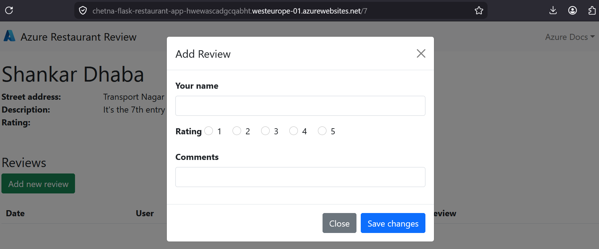
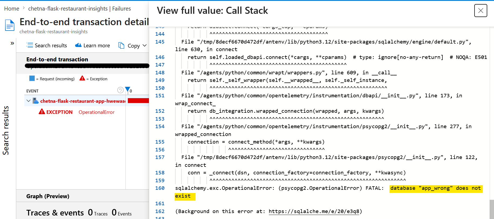
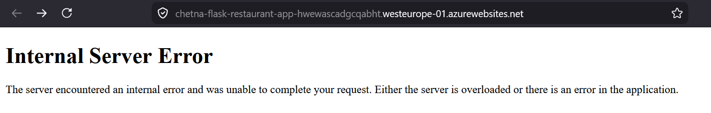
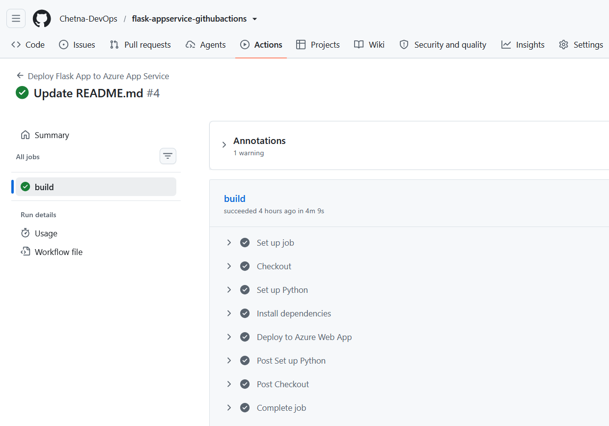
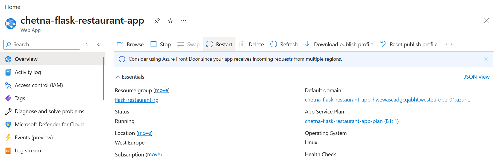
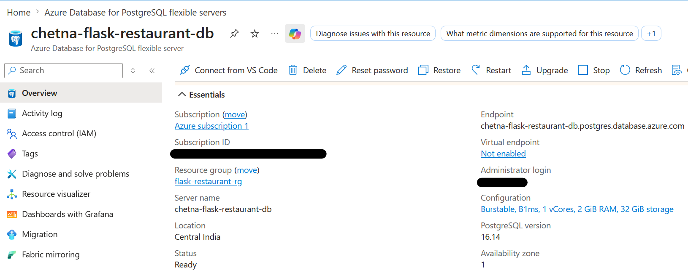
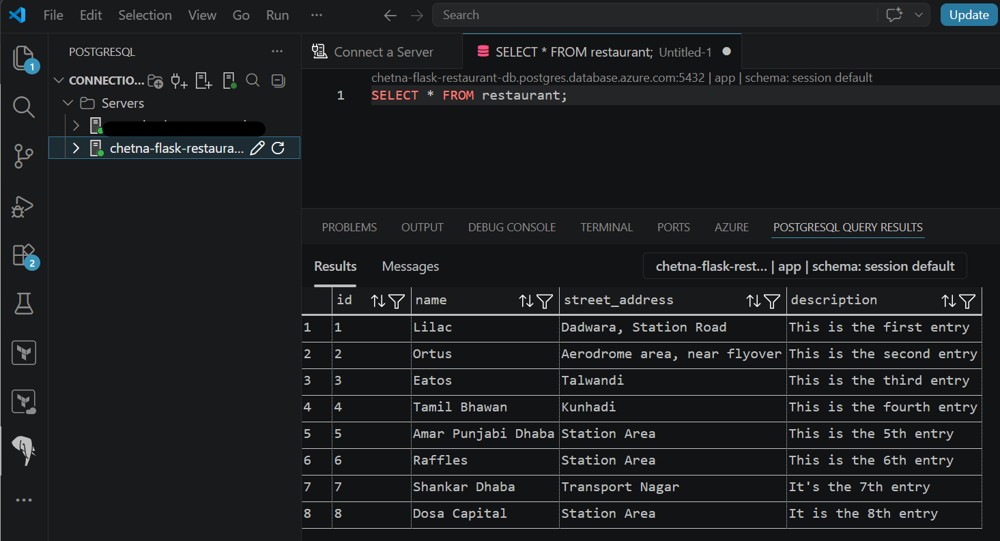
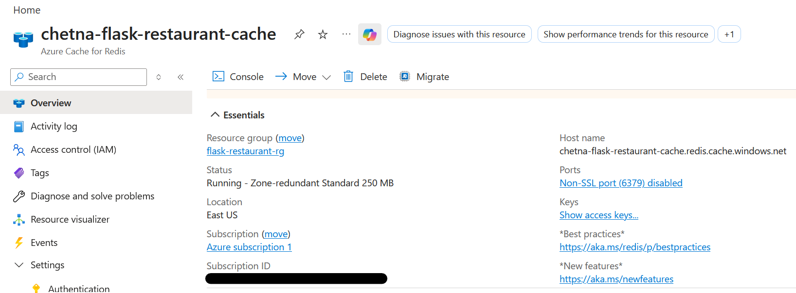

# Flask Restaurant Review App — Azure App Service Deployment

A Flask + PostgreSQL + Redis web app deployed to Azure App Service using a custom CI/CD pipeline built with GitHub Actions.

## Base application

This project starts from Microsoft's official sample app ([Azure-Samples/msdocs-flask-postgresql-sample-app](https://github.com/Azure-Samples/msdocs-flask-postgresql-sample-app)). The application code (Flask routes, models, templates) is from this sample. Everything related to deployment — the GitHub Actions workflow, Azure resource configuration and environment variable setup was built independently.

## What this project demonstrates

- Provisioning Azure resources (App Service, PostgreSQL Flexible Server, Azure Cache for Redis) manually via the Azure Portal
- Building a GitHub Actions workflow to automate deployment on every push to `main`
- Managing application configuration and secrets via App Service Environment Variables and GitHub Secrets
- Observability using Application Insights

## Architecture

```
GitHub (push to main)
   → GitHub Actions (build + deploy)
   → Azure App Service (Flask app, Python 3.12)
   → Azure Database for PostgreSQL (Flexible Server)
   → Azure Cache for Redis
```

## Application Screenshots

### Home Page


### Add Restaurant


### Reviews Page


## Observability (Application Insights)

### Failure Details Captured
Application Insights captured exception details when a faulty database configuration was introduced:



### User-facing Error Page
This is how the failure appeared to the end user:



## CI/CD Pipeline (GitHub Actions)

### Workflow Execution


- Triggered on every push to `main`
- Builds application
- Deploys to Azure App Service

## Azure Resources

### App Service


### PostgreSQL Flexible Server


### PostgreSQL Query Result in VSCode


### Azure Cache for Redis


## Tech stack
PostgreSQL, Redis, GitHub Actions, Azure App Service
