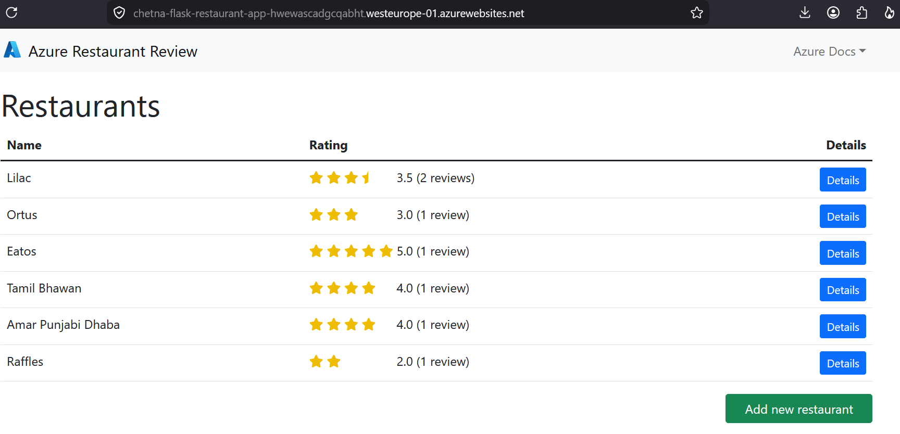
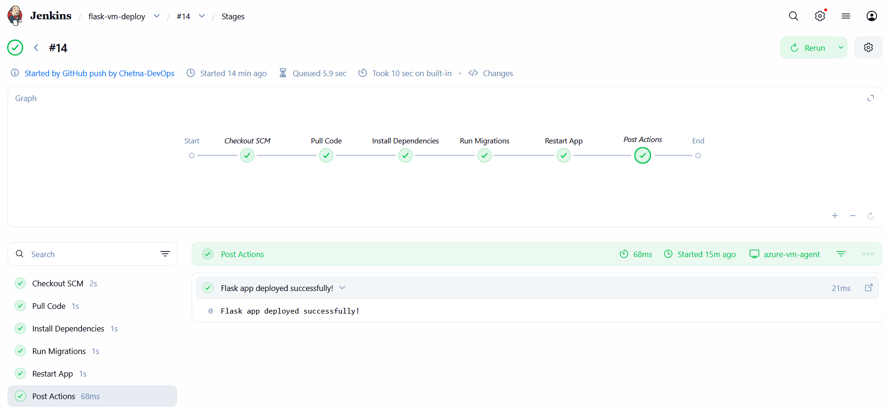
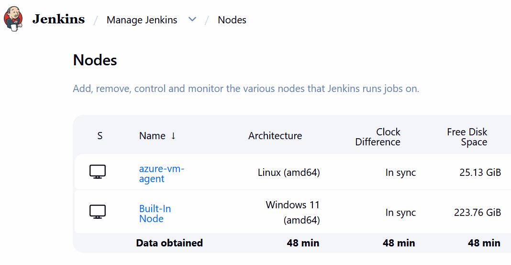
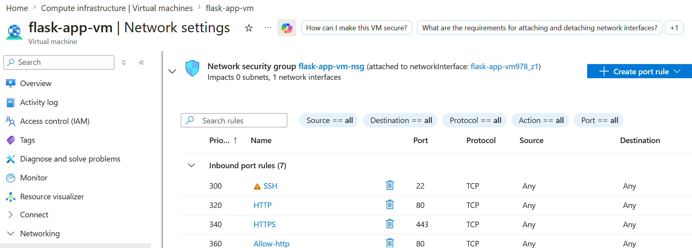
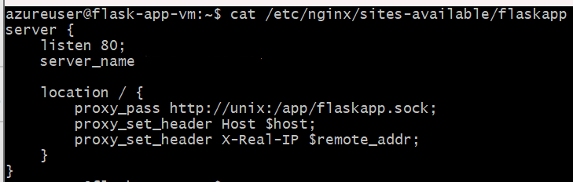
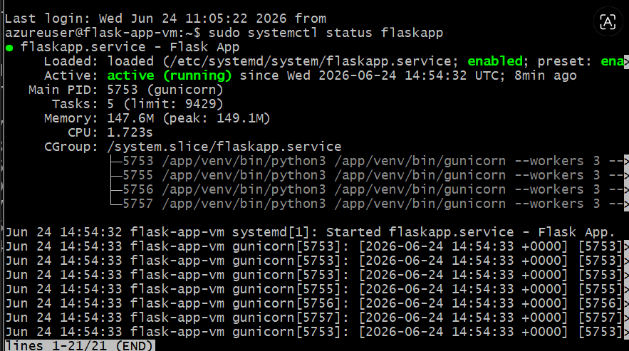

# Flask Restaurant Review App — Azure VM Deployment with Jenkins

A Flask + PostgreSQL web app deployed to an Azure Virtual Machine using a Jenkins CI/CD 
pipeline with a remote Ubuntu agent.

## Base application

This project starts from Microsoft's official sample app 
([Azure-Samples/msdocs-flask-postgresql-sample-app](https://github.com/Azure-Samples/msdocs-flask-postgresql-sample-app)). 
The application code (Flask routes, models, templates) is from this sample. Everything 
related to deployment — VM configuration, Nginx + Gunicorn setup, Jenkins pipeline and 
agent configuration was built independently.

## What this project demonstrates

- Provisioning and configuring an Azure Virtual Machine (Ubuntu)
- Setting up Gunicorn as a systemd service for production-grade Flask serving
- Configuring Nginx as a reverse proxy in front of Gunicorn
- Building a multi-stage Jenkins pipeline for automated CI/CD
- Configuring Azure VM as a Jenkins agent (controller-agent architecture)
- Automating pipeline triggers using GitHub Webhooks + ngrok

## Architecture

```
GitHub (push to main)
→ GitHub Webhook triggers Jenkins (via ngrok)
→ Jenkins Controller (local machine)
→ Jenkins Agent (Azure Ubuntu VM)
→ git pull latest code
→ pip install dependencies
→ flask db upgrade (PostgreSQL migrations)
→ sudo systemctl restart flaskapp
→ Nginx (reverse proxy, port 80)
→ Gunicorn (WSGI server, port 8000)
→ Flask App
→ Azure Database for PostgreSQL

```
## Tech Stack
| Category | Technology |
|---|---|
| App Framework | Flask + Python |
| Database | Azure Database for PostgreSQL |
| Web Server | Nginx (reverse proxy) |
| WSGI Server | Gunicorn (systemd service) |
| CI/CD | Jenkins |
| Cloud | Azure Virtual Machine (Ubuntu) |
| Webhook | GitHub Webhooks |

## Jenkins Pipeline Stages
| Stage | What It Does |
|---|---|
| Pull Code | git pull latest code from GitHub onto VM |
| Install Dependencies | pip install -r requirements.txt inside virtualenv |
| Run Migrations | flask db upgrade to apply DB schema changes |
| Restart App | systemctl restart flaskapp to pick up new code |

## Jenkins Controller-Agent Architecture
Rather than running pipeline steps on the local Windows machine (Jenkins Controller),
the Azure Ubuntu VM is configured as a Jenkins Agent. This means:
- All pipeline steps execute directly on the VM
- Clean separation between Controller (orchestration) and Agent (execution)
- Avoids Windows/Linux shell compatibility issues

## Key Technical Decisions & Why

**Gunicorn over Flask dev server** — Flask's built-in server is single-threaded and 
not suitable for production. Gunicorn runs multiple worker processes and handles 
concurrent requests properly.

**Nginx as reverse proxy** — Nginx efficiently handles incoming HTTP traffic and 
forwards dynamic requests to Gunicorn via Unix socket. Industry standard setup for 
Python apps on Linux.

**Unix socket over TCP port** — Gunicorn communicates with Nginx via a Unix socket 
(/app/flaskapp.sock) rather than a TCP port. Unix sockets are faster for local 
inter-process communication since there is no network overhead.

**systemd service for Gunicorn** — Ensures the app automatically restarts on VM 
reboot or crashes, without any manual intervention.

**Azure VM as Jenkins Agent** — Running Jenkins agent on the same Ubuntu VM where 
the app lives avoids Windows/Linux compatibility issues and simplifies the pipeline.

## Challenges Faced & How They Were Resolved
| Challenge | Root Cause | Fix Applied |
|---|---|---|
| App not accessible on browser | Port 80 blocked by Azure NSG | Added HTTP inbound rule in Network Security Group |
| SSH Agent plugin failed on Windows | Jenkins SSH Agent plugin is Linux-only | Moved Jenkins pipeline execution to Azure Ubuntu VM agent |
| `git.exe` not found on Ubuntu agent | Jenkins on Windows passes `.exe` extension to Linux agent | Installed git on VM + changed path from `git.exe` to `git` in Jenkins Tools |
| `source` command not found in pipeline | Jenkins uses `dash` shell by default, which doesn't support `source` | Added `#!/bin/bash` shebang to shell blocks in Jenkinsfile |

## Application Screenshots
### Home Page

### Jenkins Stages View

### Jenkins Nodes (Controller-Agent Setup)

### GitHub Webhook — Recent Deliveries

### Azure VM Overview

### Azure NSG — Inbound Port Rules

### Nginx Configuration

### Gunicorn Systemd Service Status

